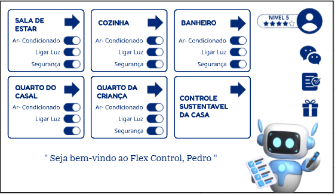

```sh
Utilize o site <https://www.toptal.com/developers/gitignore> para gerar seu arquivo gitignore e apague este campo.

Vide tutoriais do PI.
```

# FECAP - Fundação de Comércio Álvares Penteado

<p align="center">
<a href= "https://www.fecap.br/"></a>
</p>

# Planet Smart - Densenvolvimento de dashboard interativo

## Grupo: Geração Z

## Integrantes: <a href="https://www.linkedin.com/in/dandaramonike?utm_source=share&utm_campaign=share_via&utm_content=profile&utm_medium=android_app" class="no-underline">Dandara Monike</a>, <a href="https://www.linkedin.com/in/jo%C3%A3o-victor-verissimo-5613b834a?utm_source=share&utm_campaign=share_via&utm_content=profile&utm_medium=ios_app" class="no-underline">João Victor Verissimo</a>, <a href="https://www.linkedin.com/in/jo%C3%A3o-victor-verissimo-5613b834a?utm_source=share&utm_campaign=share_via&utm_content=profile&utm_medium=ios_app" class="no-underline">Jonathan Paiva</a> e <a href="https://www.linkedin.com/in/lucas-soares-corsino-885306288?utm_source=share&utm_campaign=share_via&utm_content=profile&utm_medium=android_app" class="no-underline">Lucas Soares Corsino</a>


## Professores Orientadores: <a href="https://www.linkedin.com/in/victorbarq/">Dr. Victor Von Doom</a>, <a href="https://www.linkedin.com/in/victorbarq/">Me. Saitama</a>, <a href="https://www.linkedin.com/in/victorbarq/">Dr. Strange</a>, <a href="https://www.linkedin.com/in/victorbarq/">Me. Yoda</a>, <a href="https://www.linkedin.com/in/victorbarq/">Dr. Gero</a>

## Descrição

<p align="center">
<br>
 Feito por <a href="">Grupo: Geração Z</a> <a rel="" href=""></a> <a href=""></a>
</p>

De um a dois parágrafos sobre o que é seu projeto e o que ele faz.
<br><br>
Meu projeto ajuda estudantes FECAP a configurarem seus githubs.
<br><br>
May the force be with you!
<br><br>

## 🛠 Estrutura de pastas

-Raiz<br>
|-->documentos<br>
  &emsp;|-->antigos<br>
  &emsp;|Documentação.docx<br>
|-->imagens<br>
|-->src<br>
  &emsp;|-->Backend<br>
  &emsp;|-->Frontend<br>
|readme.md<br>

## 🛠 Instalação

<b>Windows:</b>
Não há instalação! Apenas executável! (a verificar como será executado)
ou
<b>HTML:</b>
Não há instalação!
Encontre o index.html na pasta executáveis e execute-o como uma página WEB (através de algum browser).

## 🗃️ Entrega de Fundamentos de banco de dados
<b>Link:</b> <https://github.com/2025-1-NADS1/B-Projeto4/blob/06460ff410f265da69f5b45eec99b24680f1ddc0/documentos/Entrega%202/Fundamentos%20de%20Banco%20de%20dados/Readme.md><br>
<b>Caminho:</b> <documentos/Entrega 2/Fundamentos de Banco de dados/Readme.md> 

## 🎓 Referências

Aqui estão as referências usadas no projeto.

1. <https://github.com/iuricode/readme-template>
2. <https://github.com/gabrieldejesus/readme-model>
3. <https://chooser-beta.creativecommons.org/>
4. <https://freesound.org/>
5. <https://www.toptal.com/developers/gitignore>
6. Músicas por: <a href="https://freesound.org/people/DaveJf/sounds/616544/"> DaveJf </a> e <a href="https://freesound.org/people/DRFX/sounds/338986/"> DRFX </a> ambas com Licença CC 0.
